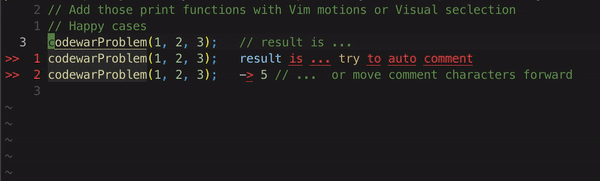

# Console-Puts
---
  

## Motivations for the plugin
- Designed for programmers who like to practice coding questions from online sources with test cases
- To add print functions to lines, it is easy for languages like Ruby that don't require parentheses around existing code. 
  - Adding the print function like `puts` in a block of test cases with multiple cursors or Visual block mode in Vim
- But it is cumbersome for languages that both use parentheses for function calls and `;` to indicate end of line
  - JavaScript needs a long `console.log(` followed by `);`
- Vim can make life lazier

---
## Features
- Provides the `cp` motion to toggle print functions on and off
- Toggles code lines with print functions like:
  - `console.log()` in JavaScript
  - `puts`, `p`, `print` in Ruby
  - `print()` in Python
  - ...etc
- Ignores empty lines and comment lines. 
  - If your test cases are at the bottom of the page, you can simply do `cpG` on the first line of test cases.
  - Or if you just want to add print to a paragraph that has both comment lines and test cases, you can do `cpip`
- Auto add comment characters after valid code in a given line (see more details below)
- Allows user to select which print functions to use if multiple options are available
- Works in both Vim Normal and Visual modes
- Color highlight to indicate whether print function is added (green) or removed (red) from the line. Highlights can be customized.
- Allows the user to add print functions to languages not supported in the plugin

---
## Usage
- If using `vim-plug`, drop this in your plugin manager
- Make sure that you have `filetype on` in your `.vimrc`, so that Vim knows what filetype you are working on.

  ```vim
  Plug 'steven-liou/console-puts'  " Toggle print functions on and off 
  ```
- The plugin comes with the Vim motion `cp`. It works in both Normal and Visual modes.
- The print option is only for the first number before the `cp` motion.
  - The available print options shown on screen after typing `cp` is only for user information.
  - Ex: `2cp2j` means select 2nd option and apply to current line and 2 lines down
- Examples :
  - To toggle the current line, `cpl`
  - To toggle two lines, `cpj`
  - To use a specific print function in line, like in Ruby using `print` instead of `puts`, `3cpl`
- The default behavior is to toggle print function on or off using the default print function of that language. If your selection has lines that have print function and lines don't, they will flip.
  - In Ruby

    ```vim
    puts "this is line 1"
    "this is line 2"
    ```
  - If you enter `cpip`, the behavior is toggling   

    ```vim
    "this is line 1"
    puts "this is line 2"
    ```

- But if you input a number before `cp`, then it will apply the print option to all lines
  - In Ruby, 

    ```vim
    puts "this is line 1"
    "this is line 2"
    ```

  - if you type `3cpip` to select a print option, it will become

    ```vim
    print "this is line 1"
    print "this is line 2"
    ```

  - If you type a number that removes the print function, or any number not in the list, It will remove all print functions. Typing `4cpip` or `8cpip` from above example will get

    ```vim
    "this is line 1"
    "this is line 2"
    ```
- You can use the motion the same way in Visual mode

---
## Examples for auto commenting

- Takes care of both the line whether it has `;` or not. Just make sure that the "padding" length is either two spaces or a `;` and a whitespace after valid code
  
    ```javascript
    "This is line 1"  two spaces after valid code will automatically be commented out
    "This is line 1"; a ; and a space after valid code will automatically be commented out

    // Result after motion
    console.log("This is line 1")  //  two spaces after valid code will automatically be commented out
    console.log("This is line 1"); //  a ; and a space after valid code will automatically be commented out

    ```
- Takes care of invalid symbols common in problems from online websites

    ```javascript
    interview("Live coding");>> interview result  // tries to comment out the invalid symbols by moving comment characters forward
    interview("Live coding") >> interview result  // tries to comment out the invalid symbols by moving comment characters forward

    // Result after motion
    console.log(interview("Live coding")); // >> interview result   tries to comment out the invalid symbols by moving comment characters forward
    console.log(interview("Live coding"))  // >> interview result   tries to comment out the invalid symbols by moving comment characters forward

    
    interview("Live coding");>> interview result Also works if the line doesn't have existing comment characters 
    interview("Live coding") >> interview result Also works if the line doesn't have existing comment characters

    // Result after motion
    console.log(interview("Live coding")); // >> interview result Also works if the line doesn't have existing comment characters
    console.log(interview("Live coding"))  // >> interview result Also works if the line doesn't have existing comment characters

    ```

---
## Custom user settings and mapping
- The users can remap the key by setting `let g:console_puts_mapping = 0`, in their `.vimrc` file. Then manually set custom mappings (default mapping is shown below)

  ```vim
  let g:console_puts_mapping = 0
  " if you want to map with a leader key
  nmap <leader>p <Plug>ConsolePutsNormal
  vmap <leader>p <Plug>ConsolePutsVisual
  ```

- If the plugin doesn't support your programming language, you can add the print function by a dictionary in your `.vimrc`. Or if you prefer to reorder the print functions for supported languages.

  ```vim
  let g:print_functions = {
    \ 'ruby' : ['puts', 'p', 'print'],
    \ 'vim' : ['echom', 'echo'],
    \ 'go' : ['fmt.Println'],
    \ }
  ```

- If the plugin doesn't support your programming language, you can specify the end of line delimiter by a dictionary in your `.vimrc`.

  ```vim
  let g:end_line_delimiters = {
      \ 'matlab' : ';',
      \ }
  ```

- If the plugin doesn't support your programming language, or if you'd like to specify parentheses anyways, you can specify the print function call open and delimiters by a dictionary with a list.

    ```vim
    let g:function_call_delimiters = {
      \ 'ruby' : ['(', ')'],
      \ 'vim' : ['(', ')'],
      \ }
    ```

- You can specify what characters are noise characters and comment them out when adding print function. You can specify a `general` list for all programming languages, and a language specific list.

    ```vim
    let g:noise_chars = {
      \ 'general' :['⇉+', '⇆+', '↔+', '⇨+', '↔+', '⇾+', '➞+', '\-+\>', '\~+\>', '\>+'],
      \ 'ruby' : ['!!'],
      \ }
    ```

- The default setting will have highlight during print function toggling for visual feedback. The default highlight duration is 750 ms. To turn off highlight or set a different timeout in ms, add this to `.vimrc`
  
    ```vim
    let g:console_puts_highlight = 0
    let g:console_puts_highlight_timeout = 750
    ```
    
- You can change the color for the add/remove print functions:

    ```vim
    highlight AddPrintLine guifg=#00ff00 ctermfg=Green
    highlight RemovePrintLine guifg=#D16969 ctermfg=Red
    ```
    
---
## Supported Programming Languages
- Go
- JavaScript
- Python
- Ruby
- Vim

---
### More details on plugin behaviors
- The plugin parses the "none-code" portion by first identifying an end of line character, either a `;` or a whitespace, then check if it is followed by one of:
  - an "invalid" characters like `->`, `>>` that typically come with online problems
  - another white space
  - comment character of the current language in the file
- If a line has an invalid character before comment character, it will move the comment character before invalid character.


---
### Bugs
- Two or more spaces in a string causes part of the code to be commented out


---
### Todos
- More language support?

